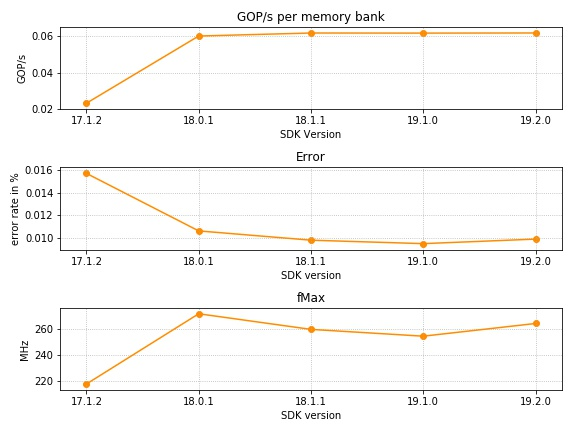

# Benchmark Results

This folder contains the results for the execution of the benchmark using the
`single` kernel on
[Noctua](https://pc2.uni-paderborn.de/hpc-services/available-systems/noctua/)
and the research cluster of the PC2.

### Execution Environment

The used boards are:
- [BittWare 520N board](https://www.bittware.com/fpga/520n/) equipped with
Intel Stratix 10 GX 2800
- [Bittware 385A board](https://www.bittware.com/fpga/385a/) equipped with
Intel Arria 10 GX1150

Details of the synthesized kernels:

| Parameter         | Value            |
|------------------ | -------------------- |
| `BOARD`           | p520_hpc_sg280l      |
| `AOC_FLAGS`       | `-fpc -fp-relaxed -no-interleaving=default -seed=2809` |
| `REPLICATIONS`    | 4                    |
| `UPDATE_SPLIT`    | 1024 |
| `GLOBAL_MEM_UNROLL`| 8  |

For the BittWare 520N board the kernels where synthesized and executed
with the Intel FPGA SDK for OpenCL, 64-Bit Offline Compiler
version 18.0.1, 18.1.1, 19.1.0 and 19.2.0.
The Bittware 385A board is synthesized with version 17.1.
C++ compiler:
- Noctua: g++ (GCC) 7.3.0
- CC: g++ (GCC) 5.4.0

### Result Interpretation

All results are summarized in the given
[CSV](./frandom_single_results.csv) file together with the fMax of the
synthesized kernel.

The benchmark results are also plotted in the figure below.
Note that the SDK version 17.1.2 is not directly comparable with the other
results since another FPGA and board was used.
One difference is the number of memory banks on the board.
For a better comparison of the results the metric _GOP/s per memory bank_ is
used in the plot instead that was calculated as follows: $`\frac{GOP/s}{\#memory\_banks}`$

